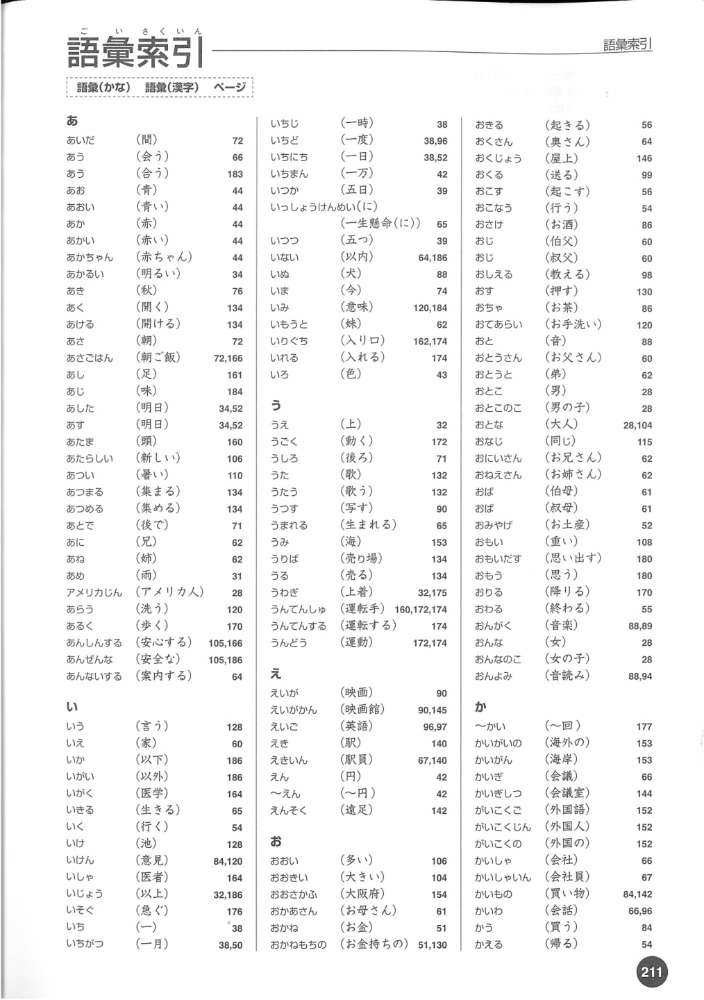
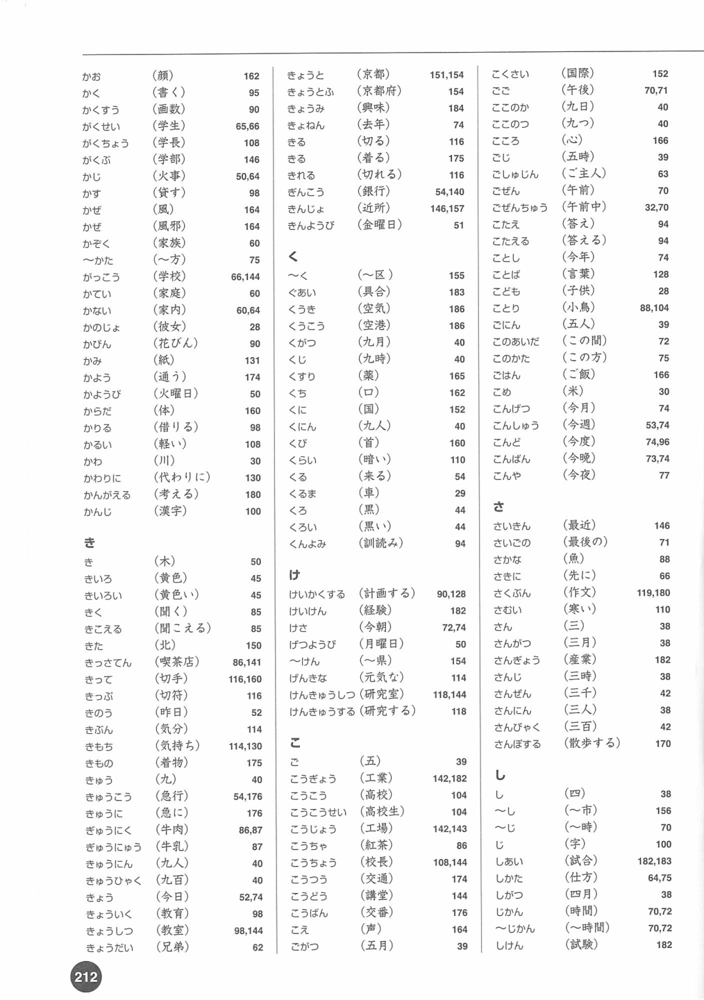
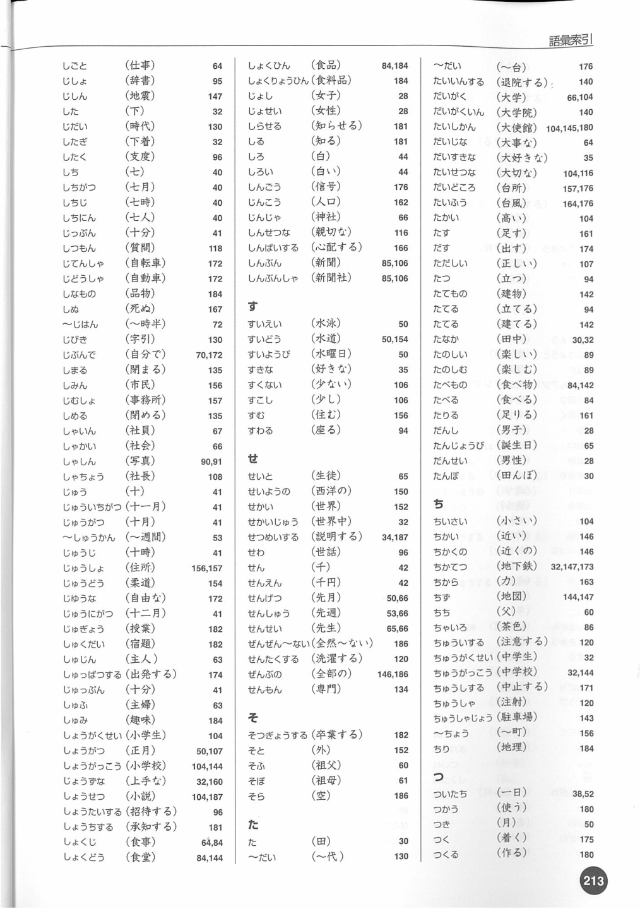
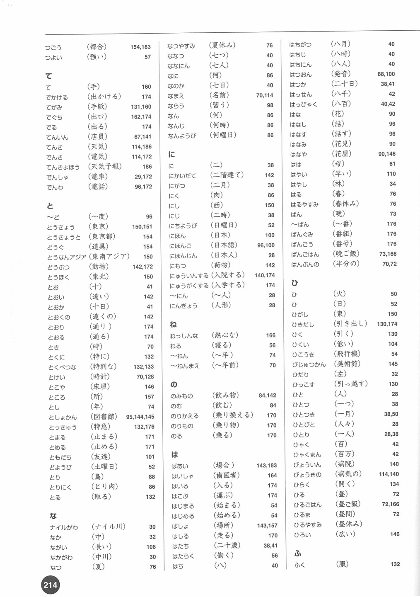
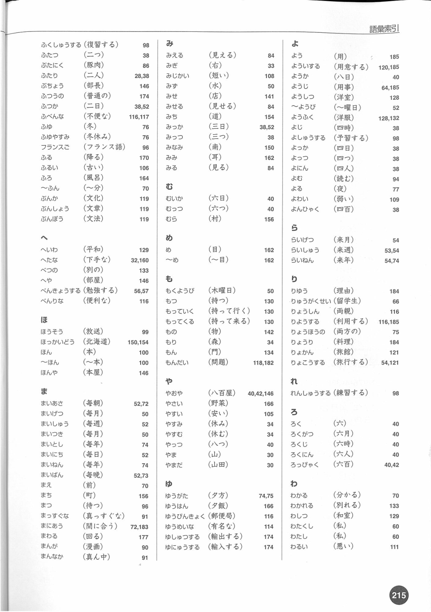

# 留学生のための漢字の教科書 初級 2
# 语彙索引 213-217 页词汇总结

## 基本说明

- 书名：`留学生のための漢字の教科書 初級 2`
- 本次整理范围：原 PDF 结构页码 `213-217`
- 这 5 页的性质：卷末 `語彙索引`
- 印刷页码对应：`211-215`
- 整理方式：
  - 保留原页图，方便逐字核对
  - 先做“按页范围 + 按主题归类”的词汇总结
  - 后续可以在此基础上继续扩为“逐词中文义 + 例句版”

## 原页图

### PDF 第 213 页

### PDF 第 214 页

### PDF 第 215 页

### PDF 第 216 页

### PDF 第 217 页

## 按页整理

## 第 213 页

这一页主要是 `あ-お`，并进入 `か` 开头的一部分词。

可确认的高频索引词包括：

- `あいだ（間）`
- `あう（会う / 合う）`
- `あお / あおい（青 / 青い）`
- `あか / あかい / あかちゃん / あかるい（赤 / 赤い / 赤ちゃん / 明るい）`
- `あき（秋）`
- `あく / あける（開く / 開ける）`
- `あさ / あさごはん（朝 / 朝ご飯）`
- `あし（足）`
- `あじ（味）`
- `あした / あす（明日）`
- `あたま（頭）`
- `あたらしい（新しい）`
- `あつい（暑い）`
- `あつまる / あつめる（集まる / 集める）`
- `あとで（後で）`
- `あに / あね（兄 / 姉）`
- `あめ（雨）`
- `アメリカじん（アメリカ人）`
- `あらう（洗う）`
- `あるく（歩く）`
- `あんしんする（安心する）`
- `あんぜんな（安全な）`
- `あんないする（案内する）`
- `いう（言う）`
- `いえ（家）`
- `いか / いがい（以下 / 以外）`
- `いがく（医学）`
- `いきる（生きる）`
- `いく（行く）`
- `いけ（池）`
- `いけん（意見）`
- `いしゃ（医者）`
- `いじょう（以上）`
- `いちじ / いちど / いちにち / いちまん（一時 / 一度 / 一日 / 一万）`
- `いつか / いつつ（五日 / 五つ）`
- `いぬ（犬）`
- `いま（今）`
- `いみ（意味）`
- `いもうと（妹）`
- `いりぐち / いれる（入口 / 入れる）`
- `いろ（色）`
- `うえ（上）`
- `うごく（動く）`
- `うしろ（後ろ）`
- `うた / うたう（歌 / 歌う）`
- `うつす（写す）`
- `うまれる（生まれる）`
- `うみ（海）`
- `うりば / うる（売り場 / 売る）`
- `うわぎ（上着）`
- `うんてんしゃ / うんてんする（運転者 / 運転する）`
- `うんどう（運動）`
- `えいが / えいがかん（映画 / 映画館）`
- `えいご（英語）`
- `えき / えきいん（駅 / 駅員）`
- `えん / ～えん（円 / ～円）`
- `えんそく（遠足）`
- `おおい / おおきい（多い / 大きい）`
- `おかあさん（お母さん）`
- `おかね / おかねもち（お金 / お金持ち）`
- `おきる / おこす（起きる / 起こす）`
- `おくさん / おくじょう / おくる（奥さん / 屋上 / 送る）`
- `おこなう（行う）`
- `おさけ / おちゃ（お酒 / お茶）`
- `おじ / おば（伯父・叔父 / 伯母・叔母）`
- `おしえる（教える）`
- `おす（押す）`
- `おてあらい（お手洗い）`
- `おと / おとうさん / おとうと（音 / お父さん / 弟）`
- `おとこ / おとこのこ / おとな（男 / 男の子 / 大人）`
- `おなじ（同じ）`
- `おにいさん / おねえさん（お兄さん / お姉さん）`
- `おみやげ（お土産）`
- `おもい / おもいだす / おもう（重い / 思い出す / 思う）`
- `おりる / おわる（降りる / 終わる）`
- `おんがく / おんよみ（音楽 / 音読み）`

## 第 214 页

这一页继续 `か-こ`，并进入 `さ`。

这一页的核心词群主要包括：

- `かう（買う）`
- `かえる（帰る）`
- `かお（顔）`
- `かく（書く）`
- `かぞえる（数える）`
- `がくせい（学生）`
- `がくちょう / がくぶ（学長 / 学部）`
- `かじ（火事）`
- `かぞく（家族）`
- `かてい（家庭）`
- `かのじょ（彼女）`
- `かようび（火曜日）`
- `からだ（体）`
- `かわ（川）`
- `かんじ（漢字）`
- `がんばる`
- `きいろ / きえる / ききます / きく`
- `きって（切手）`
- `きっぷ`
- `きぶん（気分）`
- `きもち（気持ち）`
- `きょう / きょうかしょ / きょうしつ / きょうだい`
- `きょねん（去年）`
- `ぎんこう（銀行）`
- `くうこう（空港）`
- `くに（国）`
- `くる（来る）`
- `くろ / くろい（黒 / 黒い）`
- `けさ（今朝）`
- `けしゴム`
- `けっこんします`
- `げつようび（月曜日）`
- `げんき / げんかん`
- `こうえん（公園）`
- `ごご / ごぜん（午後 / 午前）`
- `こたえる / ことば / ことし`
- `ごはん`
- `こども / こどもたち`
- `このあいだ`
- `こよみ`
- `こんげつ / こんしゅう / こんど / こんばん / こんや`
- `さいきん（最近）`
- `さいご（最後）`
- `さかな（魚）`
- `さくぶん（作文）`
- `さんぽ`

## 第 215 页

这一页主要是 `し-そ`，并进入 `た`。

可确认的索引重点包括：

- `しごと（仕事）`
- `じしん（地震）`
- `じだい（時代）`
- `した（下）`
- `したぎ（下着）`
- `したく（支度）`
- `しつもん（質問）`
- `じてんしゃ（自転車）`
- `じどうしゃ（自動車）`
- `しなもの（品物）`
- `しぬ（死ぬ）`
- `じぶん（自分）`
- `しまる / しめる（閉まる / 閉める）`
- `しゃいん（社員）`
- `しゃかい（社会）`
- `しゃしん（写真）`
- `しゃちょう（社長）`
- `じゅう（十）`
- `じゅういちがつ / じゅうにがつ / じゅうよっか` 等时间表达
- `じゅうしょ（住所）`
- `じゅうたい（渋滞）`
- `しゅう（週）`
- `しゅっせき / しゅっぱつ` 类词
- `じゅぎょう（授業）`
- `しゅくだい（宿題）`
- `しゅくじつ（祝日）`
- `しょくじ（食事）`
- `しょくひん（食品）`
- `しらせる（知らせる）`
- `しろ / しろい（白 / 白い）`
- `しんごう（信号）`
- `しんせつ（親切）`
- `しんぶん / しんぶんしゃ（新聞 / 新聞社）`
- `すいえい（水泳）`
- `すいどう（水道）`
- `すいようび（水曜日）`
- `すき / すてき / すこし`
- `すわる（座る）`
- `せいかつ（生活）`
- `せかい / せかいじゅう（世界 / 世界中）`
- `せんせい（先生）`
- `せんたくする / せんぶ（全部） / せんもん（専門）`
- `そうじする`
- `そつぎょうする`

## 第 216 页

这一页主要是 `て-の`，并进入 `は`。

索引重点包括：

- `て / てがみ / てんいん`
- `でぐち（出口）`
- `てんき / てんきよほう（天気 / 天気予報）`
- `でんき / でんしゃ / でんわ`
- `ともだち（友達）`
- `とし / としょかん`
- `どようび（土曜日）`
- `とる（取る）`
- `なつ / なつやすみ`
- `ななつ / なのか / なに / なにか / なにご`
- `なまえ（名前）`
- `ならう（習う）`
- `にく（肉）`
- `にじ / にじゅう / にほん / にほんご / にほんじん`
- `にゅういん / にゅうがく（入院 / 入学）`
- `にわ`
- `ねつしん（熱心）`
- `ねる（寝る）`
- `のぼる（登る）`
- `のる（乗る）`
- `のむ（飲む）`
- `のりもの（乗り物）`

## 第 217 页

这一页主要是 `は-わ`，也就是索引的结尾部分。

这一页可确认的高频词包括：

- `はいります / はじまる`
- `はし / はしる`
- `はたち（二十歳）`
- `はな / はなす / はなし / はなび / はは（花 / 話す / 話 / 花火 / 母）`
- `はやい（早い）`
- `はる / はるやすみ（春 / 春休み）`
- `ばんぐみ / ばんごう`
- `ひがし / ひく / ひこうき / ひだり`
- `ひと / ひとつ / ひとり / ひゃく`
- `びょういん（病院）`
- `ひろい（広い）`
- `ふく（服）`
- `ふたつ / ふたり`
- `ふゆ / ふゆやすみ（冬 / 冬休み）`
- `ぶんか / ぶんぽう / ぶんしょう（文化 / 文法 / 文章）`
- `へいわ（平和）`
- `へた / べんきょうする / べんりな`
- `ほうそう（放送）`
- `ほくかいどう（北海道）`
- `ほん / ほんや`
- `まいあさ / まいしゅう / まいにち / まいねん`
- `まち / まっすぐな / まど / まるい / まんなか`
- `みぎ / みじかい / みず / みせ / みち / みなみ / みみ / みる`
- `むら`
- `め / ～め / もつ / もっと / もっていく / もってくる / もり`
- `やおや / やさい / やさしい / やすい / やすみ / やっつ / やま / やまだ`
- `ゆうがた / ゆうびん / ゆうめいな / ゆき / ゆっくりする / ゆしゅつする`
- `ようい / ようじ / ようふく / よやく / よる / よわい`
- `りゆう / りようする / りょうり / りょかん / りょこうする`
- `れんしゅうする`
- `ろく / ろっかげつ`
- `わかる / わかれる / わたし / わたくし / わるい`

## 按主题重排词汇

下表不是逐字母顺序，而是为了复习更快，把这 5 页索引中最常用的词按主题重新归类。

| 主题 | 词汇 |
|---|---|
| 家人 / 人物 | `お父さん` `お母さん` `お兄さん` `お姉さん` `おとうと` `いもうと` `あに` `あね` `おじ` `おば` `男` `女` `男の子` `女の子` `大人` `子どもたち` `会社員` `先生` `社長` `留学生` `部長` |
| 时间 / 数字 / 频率 | `一時` `一日` `一度` `今` `今日` `今夜` `今度` `今年` `来月` `来年` `去年` `毎朝` `毎日` `毎週` `毎月` `毎年` `～時半` `～年` `～人` `～分` `半分` |
| 学校 / 学习 | `漢字` `英語` `日本語` `外国語` `辞書` `意見` `質問` `授業` `宿題` `作文` `文法` `文章` `勉強する` `練習する` `論文` `医学` `文化` `社会` `歴史` `専門` `先生` `生徒` `大学` `大学院` |
| 交通 / 出行 | `駅` `駅員` `空港` `飛行機` `電車` `自転車` `自動車` `運転手` `運転する` `入口` `出口` `旅館` `旅行する` `持って行く` `持って来る` |
| 生活 / 家居 | `家` `台所` `お手洗い` `部屋` `上着` `服` `池` `窓` `丸い` `広い` `きれい` `便利な` `不便` `安全な` |
| 饮食 / 购物 | `朝ご飯` `味` `お酒` `お茶` `食事` `食品` `食料品` `料理` `野菜` `肉` `豚肉` `買う` `買い物` `売る` `売り場` `店員` `やおや` |
| 动作动词 | `会う` `合う` `言う` `行く` `生きる` `入れる` `起きる` `起こす` `開く` `開ける` `洗う` `歩く` `集まる` `集める` `教える` `押す` `思う` `思い出す` `降りる` `終わる` `帰る` `書く` `切る` `食べる` `乗る` `飲む` `見る` `分かる` `分かれる` |
| 状态 / 形容 | `新しい` `暑い` `明るい` `重い` `軽い` `暗い` `熱心` `元気` `親切` `強い` `弱い` `早い` `広い` `丸い` `悪い` |
| 场所 / 地理 | `海` `海岸` `川` `京都` `国` `外国` `日本` `北海道` `東` `西` `南` `村` `町` `道` `空港` `公園` |

## 复习建议

因为这 5 页本身是卷末索引，最适合这样用：

1. 先看原页图，熟悉词是怎么按 `かな` 排序的。  
2. 再用“按主题重排词汇”做第二轮复习。  
3. 如果你后面要做精细版，可以继续补：
   - 每个词的中文释义
   - 每个词的例句
   - 对应本书正文页码的用法说明

## 本次整理结论

- `213-217` 页不是单元课后词表，而是整本书的 `語彙索引`。  
- 这 5 页覆盖了本书卷末的大部分常用检索词。  
- 已经按“原页图 + 页码范围 + 主题总表”整理为第一版，可直接用于检索和复习。  
- 如果你下一步要，我可以继续把这一份扩成：
  - `逐词中文义版`
  - `逐词例句版`
  - `按页码回链正文版`
